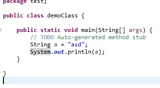
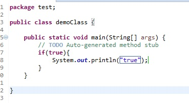
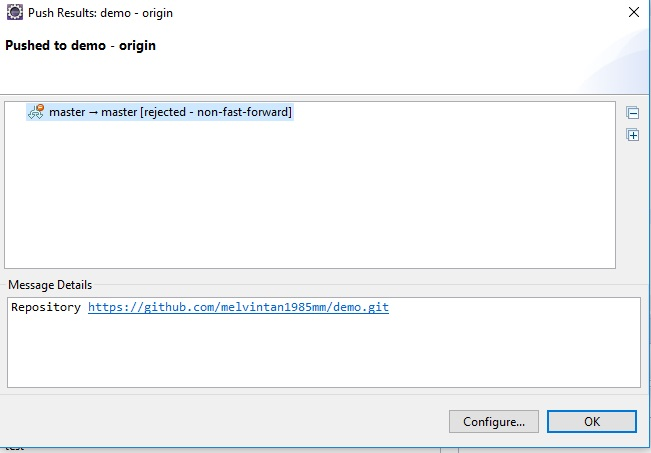
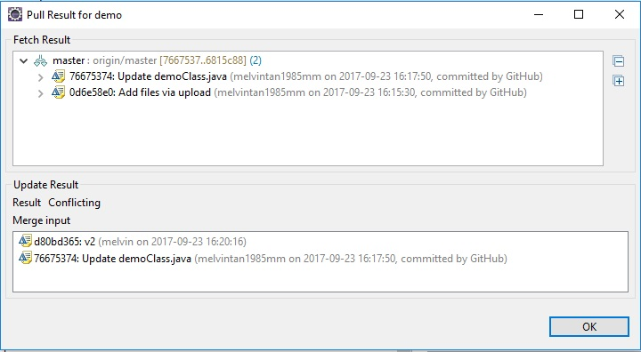
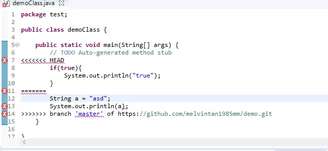

# Repository merge

## situation where both developer is edit a file
nameing used in this example:
- V1 = version 1 also known as the original file
- v2 = version 2 of the file (which is edited by developer1)
- v3 = version 3 of the file (which is edited by developer2)

# manual way (pull and edit manually)
1) 2 developers download the fileV1

2) 1st developer update the and commmit the changes 1st (now the git repository is V2 of the file).

3) 2nd developer is unaware of the 1st developer actions and he edited the fileV1 and decided to commit and push his changes which is V3 of the file. 

4) developer 2 will encounter a error when he is committing and pushing his file 

5) Developer 2 will then know that somthing is wrong and he should right-click his proj and pull the lastest changes from github

6) eclipse will then prompt developer 2 on the pull result and update the file which have conflicts, u will then see the pic below 

7) the `HEAD` section to the `=======` section is the code from developer 2 and the `=======` section to the 
`branch master.....` is the code of V2 which is committed and pushed into github previously

8) developer2 will manually edit the codes and save it, then he will go to git staging view panel and if the file is under `Unstaged Changes` then developer2 will right-click the file and `Add Index` then drag it to `Staged changes` and click commit and push.
Note: any file under `Unstaged Changes` cannot be commited and only files under `Add Index` will be able to be commmitted.

# Auto merge (automatically merge V2 and V3)

1) when developer 2 is unable to commit, he right-click the project and click on pull and merge.

2) it will automatically merge (no gurantee success)

